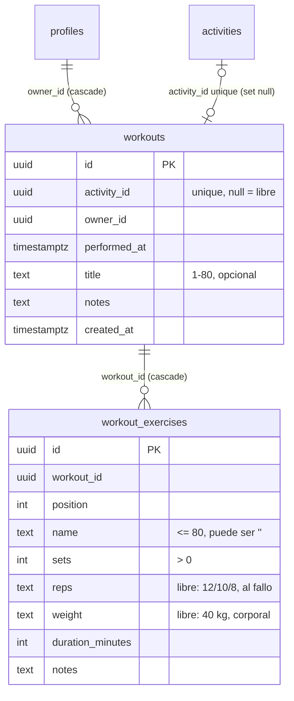
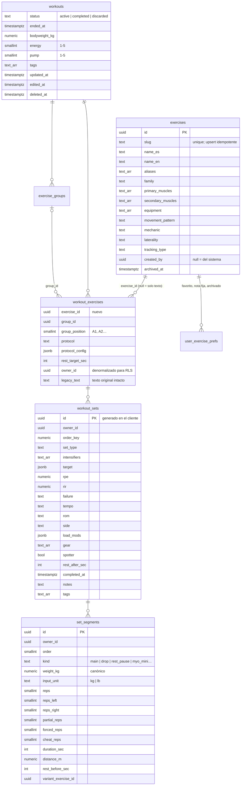

# Gym Tracker — Contexto, auditoría y plan de upgrade

Fases 0 y 1 de `prompt-gym-tracker-upgrade.md`. **No se ha escrito código del upgrade.**
Este documento termina con las decisiones que necesitan tu OK antes de empezar la Fase 2.

Fecha: 4 de octubre de 2026 · Estado del repo: `main` en `e6e55cf`.

---

## 1. Resumen de contexto (Fase 0)

Leídos: `CLAUDE.md`, `AGENTS.md`, `README.md`, las 11 specs, `plan.md`, `tasks.md`, las skills
`kavi-dev` y `kavi-design`, `docs/manual-tecnico.md` y los informes de pruebas y rendimiento.
Las referencias de terceros (`vercel-react-native-skills/rules/*`, `ui-ux-pro-max`) las revisé
a través de `kavi-dev`, que es su síntesis vigente. Los informes de ZAP y sus `LICENSE.md` no
aplican al módulo.

**Stack**
- Expo SDK 57, React Native 0.86, Expo Router con rutas en `src/app/`, TypeScript `strict`, React Compiler activo.
- Supabase: Auth, Postgres, RLS y Realtime. TanStack Query para datos del servidor y Zustand para estado local mínimo.
- `date-fns`, `react-hook-form` + `zod`, `lucide-react-native`, `react-native-svg`, `react-native-gesture-handler` y `reanimated`.
- **No están instalados**: `expo-haptics`, `expo-crypto` (UUID en el cliente), FlashList ni ninguna librería de gráficas o i18n.

**Arquitectura**
- Capas fijas: `app/` (rutas) → `hooks/` (TanStack) → `services/*.ts` (fachadas) → `services/backend.ts`, que elige `services/supabase/*` o `services/demo/*`. Solo `services/supabase/*` toca Supabase.
- Toda función de datos nueva se declara en `services/contracts.ts` y se implementa **en los dos backends** a la vez.
- Las implementaciones no usan `this`: la fachada reexporta los métodos sueltos.
- Persistencia local: `lib/storage.ts`, un almacén clave-valor multiplataforma (AsyncStorage en nativo, localStorage en web). Lo usan las preferencias y sirve para la sesión a prueba de cierres sin agregar dependencias.
- No hay cola offline (NFR-17): las mutaciones fallan con un error claro.

**Backend**
- Migraciones versionadas en `supabase/migrations/`. Toda tabla nace con RLS y sus políticas en el mismo archivo.
- Lección aprendida en este repo: una política de SELECT que consulta su propia tabla con una función `stable` rompe `INSERT … RETURNING` (error 42501, el mismo que da una sesión caducada).
- No tengo `service_role` ni acceso directo a la base. El SQL lo corres tú en el SQL Editor, y **antes** de que el código que depende de él llegue a Vercel.

**Diseño**
- La app es monocroma y el color viene de los datos (dimensiones). Es oscura por omisión, con tokens en `constants/theme.ts`, iconos lucide y nunca emojis como iconos.
- Toques mínimos de 44/48 px, español es-MX y hora en 24 h.
- No hay i18n: el idioma ES/EN está en la tarea T196, pendiente.

**Convenciones**
- Identificadores en inglés y UI en español. Los tipos de dominio usan `snake_case` igual que la base (`performed_at`, `activity_id`).
- Commits `[Txxx] descripción`, con `[x]` en `tasks.md` en el mismo commit. SDD: nada se implementa sin spec.
- 140 pruebas Jest cubren fitness hoy (7 archivos).

**Reglas explícitas que afectan este trabajo**
- Constitución P2 ("Nada de configuraciones avanzadas en V1") y P8 ("métricas avanzadas… no se implementa").
- Spec 07: "campos abiertos y sencillos… sin catálogos rígidos" y "V1 sin estadísticas/gráficas".
- El backlog de `tasks.md` marca "Estadísticas de entrenamientos · plantillas de rutina" como **NO implementar**.

**Contradicciones entre docs y código**: no encontré ninguna en el módulo; el código cumple la spec 07. Las
contradicciones están entre **el prompt y las specs** (ver §8).

---

## 2. Mapa de archivos del módulo

| Capa | Archivo | Qué hace |
|---|---|---|
| Ruta | `src/app/(app)/(tabs)/fitness.tsx` | Historial (`FlatList`) + "Entrenamiento libre" |
| Ruta | `src/app/(app)/workout/[id].tsx` | Captura/edición y lectura de un entrenamiento; hoja "Duplicar en…" |
| Ruta | `src/app/(app)/activity/[id].tsx` | Botón "Registrar / Ver entrenamiento" si `is_gym` y eres dueña |
| Ruta | `src/app/(app)/activity/new.tsx` + `components/calendar/workout-draft.tsx` | Borrador de ejercicios al crear una actividad de gym (RF-F9) |
| UI | `src/components/fitness/exercise-card.tsx` | Tarjeta de ejercicio con 6 campos libres; guarda al perder foco |
| Calendario | `src/components/calendar/derived.ts` | Entrenamientos sin actividad como bloques derivados (RF-F10) |
| Hooks | `src/hooks/use-workouts.ts` | Consultas y mutaciones; claves `['workouts', …]` |
| Contrato | `src/services/contracts.ts` → `WorkoutsApi` | 11 métodos |
| Backends | `src/services/supabase/workouts.ts`, `src/services/demo/workouts.ts` | Implementaciones; demo con una sesión semilla de pierna |
| Tipos | `src/types/domain.ts` → `Workout`, `WorkoutExercise`, `*Input` | |
| Estado | `src/store/preferences-store.ts` | `lastWorkoutTitle`, `showWorkouts` |
| Perfil | `src/app/(app)/(tabs)/profile.tsx` | Contador de entrenamientos e interruptor de la capa del calendario |
| Admin | `supabase/migrations/20260919000800_admin.sql` | `total_workouts` en estadísticas agregadas |
| SQL | `…000600_workouts.sql`, `…001000_workout_fixes.sql`, `…120000_workout_title.sql` | Esquema + RLS |

No hay catálogo de ejercicios: el "catálogo" es el autocompletado con los nombres que la persona
ya escribió (`exerciseNames`).

---

## 3. Modelo de datos actual

- Índices: `(owner_id, performed_at desc)` en `workouts` y `(workout_id, position)` en `workout_exercises`.
- RLS: `workouts_owner` usa `owner_id = auth.uid()` y `wex_owner` usa un `exists` contra `workouts`. Sin riesgo de recursión.
- **No hay** `updated_at`, borrado suave ni unidades. La duración total es derivada (suma de ejercicios).

---

## 4. Flujos actuales

1. **Crear sesión**: desde una actividad de gym ("Registrar entrenamiento", 1:1), desde Fitness ("Entrenamiento libre", con el título del anterior) o desde el formulario de actividad (RF-F9, se crea al guardar la actividad).
2. **Agregar ejercicio**: "+ Ejercicio" inserta de inmediato una fila con `name = ''`, que se escribe dentro de la tarjeta.
3. **Registrar "series"**: no existen series. Hay un número `sets` y un texto `reps` ("12/10/8") por ejercicio. Cada campo se guarda al perder el foco.
4. **Terminar**: no existe "terminar"; el botón "Listo" cierra la pantalla. No hay estado de sesión activa.
5. **Historial**: lista descendente con nombre, fecha, número de ejercicios y duración. El detalle se abre en modo lectura.
6. **Editar**: el botón "Editar" usa la misma pantalla en modo edición. **Duplicar** copia los ejercicios a una actividad futura o a una sesión libre, con o sin valores.

---

## 5. Estado y persistencia

- Guardado **campo por campo al perder el foco**. No hay actualización optimista: la UI muestra el estado local de la tarjeta y el servidor confirma después.
- Si la app se cierra a media sesión, se pierde **solo el campo que se estaba escribiendo**. Todo lo anterior ya está en el servidor. No hay recuperación porque no hay nada que recuperar: no existe la noción de sesión activa.
- Realtime no escucha `workouts`, porque son privados y de una sola persona.
- Sin conexión, cada guardado falla con un banner de error.

---

## 6. Diagnóstico

### Se conserva
- La entrada desde el calendario (RF-F1, RF-F9) y la capa derivada en el calendario (RF-F10). Son lo distintivo de KAVI frente a una app de gym suelta.
- La privacidad: los invitados a una actividad de gym no ven el entrenamiento.
- El guardado incremental sin botón de "guardar todo".
- Duplicar, que es la semilla natural de "repetir rutina".
- El nombre propio de la sesión, propuesto a partir del anterior.

### Bugs encontrados
1. **Duplicar pierde el nombre de la sesión.** Ninguno de los dos backends copia `title` (`supabase/workouts.ts` y `demo/workouts.ts`, en `duplicate`). Una sesión "Pierna" duplicada sale como "Entrenamiento libre".
2. **La duración del encabezado no se actualiza** al editar la duración de un ejercicio. `updateExercise` solo invalida `names` y no el detalle, así que el total queda viejo hasta recargar.
3. **Ejercicios fantasma**: "+ Ejercicio" crea la fila antes de tener nombre. Si sales sin escribir, queda un ejercicio vacío que el historial cuenta y la vista de lectura muestra sin título.
4. **Divergencia entre backends** en `exerciseNames`: el demo ordena por frecuencia y Supabase alfabéticamente. Así, el autocompletado se comporta distinto en demo y en producción.

### Deuda técnica
- Dos tarjetas de ejercicio paralelas: `ExerciseCard` y `DraftCard` en `workout-draft.tsx`, con la misma lógica duplicada.
- Peso y reps en texto libre: no se puede calcular volumen, PRs ni progresión, que es justo lo que pide el upgrade.
- Falta `updated_at` y borrado suave, ambos necesarios para editar con recálculo y para la sesión a prueba de cierres.

### Riesgos de rendimiento
- `list()` trae **todos los ejercicios de todos los entrenamientos** solo para contarlos (`exercises:workout_exercises(*)`), sin paginar. Crece sin límite con los años de historial.
- `exerciseNames()` lee todas las filas de ejercicios de la persona para sacar nombres únicos. Mismo problema.
- Hoy no pesa (decenas de sesiones), pero con series y segmentos el volumen de filas se multiplica por 10–30.

### Huecos de UX frente a lo que pide el upgrade
- Registrar una serie requiere escribir texto en varios campos: ni siquiera existe "una serie".
- Sin timer de descanso, sin "la vez anterior" y sin PRs.
- El teclado del sistema tapa media pantalla en cada campo.

---

## 7. Modelo propuesto (resumen para aprobar; el detalle va en la Fase 2)

Se **extienden** las tablas que ya existen y se agregan otras nuevas. No se renombra ni se borra nada.

Decisiones de diseño que vale la pena leer:
- **`owner_id` denormalizado en cada tabla hija**, con un trigger que lo copia del padre y rechaza discrepancias. Así todas las políticas quedan en `owner_id = auth.uid()`. Evita cadenas `exists` de tres niveles en cada fila de segmento y la trampa del `RETURNING` que ya costó una tarde con `lists`.
- **IDs generados en el cliente** (UUID v4). Permiten crear una serie en la UI antes de que responda el servidor y recuperar una sesión tras un cierre sin duplicar nada: reenviar es un `upsert` por id. Requieren `expo-crypto` (ver §8).
- **El catálogo vive en Postgres** como los temas: filas del sistema (`created_by null`) más las personalizadas de cada quien. Se descarga completo una vez y se busca en el cliente (~530 filas ≈ 120 KB). Una sola fuente, `src/constants/exercise-catalog.ts`, alimenta al demo y a un script que genera la migración SQL. Así las dos versiones no se pueden separar.
- **Derivados calculados, no guardados**: volumen, e1RM y PRs. Sin tabla `personal_records` al principio: nada que recalcular mal al editar. Si algún día pesa, se agrega como caché con recálculo.
- **El texto libre no se pierde nunca.** `name`, `sets`, `reps`, `weight` y `duration_minutes` se quedan donde están. Lo que el parser no entiende se sigue mostrando tal cual.

---

## 8. Decisiones tomadas (4 de octubre de 2026)

| # | Decisión |
|---|---|
| D1 | **Solo se reescribe la spec 07** (Fitness v2). La constitución no se toca: la tensión formal con P2/P8 queda reconocida aquí y en la spec, y se acepta porque V1 ya se entregó. |
| D2 | El texto libre original se conserva y sigue visible; se puede seguir registrando por nombre libre (ejercicio personalizado al vuelo). |
| D3 | **Racha que no se pierde sola.** Una semana sin entreno deja la racha *en pausa*: la app pregunta qué pasó, permite una nota y **la persona decide** si la racha sigue o se reinicia. |
| D4 | **La persona elige cómo le habla el Modo Gymrat**: rey, reina o neutral (neutral por omisión). "Modo serio" apaga el humor. |
| D5 | **Cero dependencias nuevas durante G1–G7.** Revisado el 4 oct: `expo-haptics` y `expo-audio` (gratuitas, oficiales de Expo) entran en G8, juntas, para recompilar la app nativa una sola vez. No esperar al servidor se resuelve con almacenamiento asíncrono (`lib/storage`). Los IDs se generan en el cliente con un generador UUID v4 propio, que no necesita ser criptográfico: la seguridad la da la RLS, no lo impredecible del id. Para el háptico se usa `Vibration` de RN solo en Android; en iOS y web, nada. |
| D6 | Cola local solo para la sesión activa (no es un modo offline general). |
| D7 | El catálogo se construye antes que el logger. |
| D8 | Typecheck, lint y prueba manual en la app. **Sin pruebas automáticas por ahora** (indicación de Areli, 4 oct): lo que haría falta probar se apunta en `reports/pruebas-pendientes.md` para una sesión dedicada. |
| D9 | Sin plantillas en este upgrade. |

## 8.1 Contradicciones originales (para la historia)

| # | Choque | Mi recomendación |
|---|---|---|
| D1 | **Alcance.** La constitución P2/P8, la spec 07 ("sin catálogos rígidos", "sin estadísticas") y el backlog ("no implementar estadísticas ni plantillas") prohíben buena parte del upgrade. V1 ya se entregó el 26 de septiembre. | Enmendar la constitución: P7/P8 quedan como "alcance de V1, cerrado" y se agrega un alcance V2 que incluye el upgrade de fitness. La spec 07 se reescribe como "Fitness v2" conservando lo de §6 "Se conserva". Sin esto, el flujo SDD me obliga a detenerme en cada tarea. |
| D2 | **Texto libre vs. estructura.** El criterio de la spec 07 dice que `"12/10/8"` y `"40kg + cadena"` se conservan exactamente igual. | Se conservan: el texto original queda intacto y visible. Además se puede seguir registrando un ejercicio por nombre libre (se crea un ejercicio personalizado al vuelo), para no romper la promesa de "escribe a tu manera". |
| D3 | **Rachas.** El prompt pide "Racha de Hierro" y "racha y calendario". La spec 10 decidió **no** usar rachas: "un número que se rompe convierte un mal día en una pérdida". | Mostrar **semanas entrenadas en las últimas 12** y un calendario de entrenos, sin contador que se rompa. El logro se vuelve "12 semanas con al menos un entreno", que no se pierde al fallar una semana. |
| D4 | **Microcopy.** "¡PR, mi rey!" y "Bro…" asumen género masculino, y los emojis chocan con la regla de diseño (sin emojis como iconos, app sobria). | Mismo tono, pero neutral ("¡PR! Eso no lo levanta cualquiera"). Emojis solo en el texto de celebración del Modo Gymrat, nunca como icono, y apagados en "Modo serio". |
| D5 | **Dependencias nuevas.** `expo-haptics` (háptico al contar reps, al marcar ✓ y en PRs) y `expo-crypto` (`randomUUID`). Las dos son de Expo, pesan poco y en web no hacen nada. | Instalarlas. Alternativas sin dependencia: `Vibration` de RN (en iOS es un zumbido largo, no un toque) e IDs del servidor (obligan a reconciliar IDs temporales y complican la recuperación tras un cierre). **Ojo:** son módulos nativos, así que hace falta una build nueva de Android. Se cargan con `require` perezoso y fallback, como las notificaciones, para que un binario viejo no truene. |
| D6 | **Sesión a prueba de cierres vs. NFR-17** ("sin cola offline en V1"). | Una cola local **solo para la sesión activa**: cada serie se escribe en `lib/storage.ts` y en el servidor, y al reabrir se reenvía lo pendiente por `upsert`. No es un modo offline general. Entra en la enmienda D1. |
| D7 | **Orden de fases.** El prompt pone el catálogo (Fase 7) después del logger (Fase 3), pero el logger necesita elegir ejercicios. | Construir el catálogo **antes** del logger. Lo demás en el orden del prompt. |
| D8 | **Pruebas.** Antes me pediste no correr la suite en cada cambio y apuntar las pendientes. El prompt pide typecheck + lint + tests al cerrar cada fase. | Typecheck y lint en cada tarea; la suite completa solo al cerrar cada fase, como piden el prompt y `CLAUDE.md`. |
| D9 | **Plantillas.** El prompt dice "si existen, extiéndelas", y no existen; el backlog las prohíbe. | No crearlas en este upgrade. Los objetivos por serie (`target`) más "Duplicar" ya funcionan como plantilla. Si las quieres, son una fase aparte después. |

---

## 9. Estrategia de migración de los datos existentes

**Principio:** el esquema crece y los datos viejos se leen igual que hoy hasta que se convierten. Nada se borra.

1. **Migración SQL (la corres tú, antes del deploy).** Solo agrega columnas con default, tablas nuevas, RLS, triggers de `owner_id` y `updated_at`, y el catálogo por `upsert` sobre `slug`. Es idempotente (`if not exists`, `on conflict do update`) y se puede correr dos veces sin daño.
2. **Conversión de los logs viejos, en el cliente y con un solo parser en TypeScript con pruebas.** Se hace en la app con tu sesión, así que la RLS aplica y no hace falta `service_role`. Por cada `workout_exercise` con texto y sin series:
   - `sets=4, reps="8/8/6/6", weight="80 kg"` → 4 series `working` de 80 kg × 8, 8, 6, 6.
   - `sets=3, reps="12"` → 3 series de 12.
   - `reps="al fallo"` → series `failure` con reps vacías.
   - `weight="corporal"` → el ejercicio se marca como de peso corporal.
   - Lo ambiguo (`"25 lb por lado"`, `"40kg + cadena"`, número de series que no cuadra con la lista de reps) **no se adivina**: se crean las series con lo seguro y el texto original queda a la vista con un botón "Revisar".
   - Cada serie convertida nace con un segmento `main`, como pide la Fase 2.
3. **El nombre libre se mapea al catálogo** con la misma búsqueda tolerante (acentos, alias). Si la coincidencia es única y exacta, se liga; si no, se crea un ejercicio personalizado con ese nombre. El reporte de lo que no mapeó queda en la pantalla del ejercicio, no se descarta en silencio.
4. **Idempotencia**: solo se convierte lo que tiene texto y cero series. Reintentar no duplica, porque los IDs se derivan del id del ejercicio viejo.
5. **Rollback**: borrar las series convertidas (`delete from workout_sets where converted_from_legacy`) devuelve todo al estado actual, porque las columnas originales nunca se tocaron. El esquema nuevo puede quedarse aunque la UI vuelva atrás.

---

## 10. Plan de implementación

Cada fase cierra con typecheck, lint, la suite completa y un resumen corto. Las tareas entran a `tasks.md` como T238 en adelante.

| Fase | Contenido | Archivos principales | Impacto / riesgo |
|---|---|---|---|
| **G0 · Specs** | Enmienda a la constitución (D1), spec 07 v2, §9 del modelo de datos, fase nueva en `tasks.md`. **Sin código.** | `specs/00`, `specs/07`, `specs/02`, `tasks.md` | Nulo en runtime |
| **G1 · Datos** (Fase 2) | Migración (columnas, 4 tablas, RLS, triggers), tipos de dominio, contratos y los dos backends; `lib/gym/` con volumen, e1RM (Epley/Brzycki), PR, kg↔lb, RPE↔RIR y el parser de legado, todo con pruebas. Corrige los bugs 1, 2 y 4. | `supabase/migrations/2026100…_gym_v2.sql`, `types/domain.ts`, `services/contracts.ts`, `services/{demo,supabase}/workouts.ts`, `lib/gym/*` | **Requiere correr SQL antes del deploy.** Los datos viejos siguen visibles |
| **G2 · Catálogo** (Fase 7) | ≥ 530 ejercicios con nombre en inglés, alias, músculos, equipo, patrón y `tracking_type`; búsqueda sin acentos y por alias; filtros; selector virtualizado; personalizados, favoritos y recientes; mapeo de nombres viejos. | `constants/exercise-catalog.ts`, `scripts/gen-exercise-seed.mjs`, `lib/gym/search.ts`, `components/fitness/exercise-picker.tsx` | La fase con más volumen de datos. El seed es grande pero idempotente |
| **G3 · Logger** (Fase 3) | Fila `# · Anterior · kg · Reps · RIR · ✓` en ≤ 2 toques; teclado numérico propio; modo contador; objetivo vs. realizado; unilateral; parciales; cronómetro. Al marcar ✓: guardado optimista, descanso, PR, precarga. Swipe con deshacer y botones visibles en web; drag para reordenar; timer guardado como hora de fin + notificación local; sesión activa en `lib/storage`; discos, calentamiento y 1RM. | `app/(app)/workout/[id].tsx` (se reescribe), `components/fitness/{set-row,numpad,rest-timer,…}.tsx`, `hooks/use-active-session.ts` | El cambio de UI más grande. Reemplaza las tarjetas de texto libre. Necesita la build nueva (D5) para el háptico |
| **G4 · Edición** (Fase 4) | La misma UI del logger sobre sesiones pasadas; cambiar ejercicio conservando series; partir y unir series; mover series; deshacer/rehacer; `edited_at` e indicador "editado"; recálculo. | Reutiliza G3 + `lib/gym/undo.ts` | Bajo, si G3 ya está aislado |
| **G5 · Intensificadores** (Fase 5) | Hoja con buscador; 9 tipos de serie; 25 extensiones que transforman la fila; 9 agrupaciones con A1/A2 y descanso por ronda; 14 protocolos con timers EMOM/Tabata; modificadores de esfuerzo. | `constants/intensifiers.ts`, `lib/gym/transforms.ts`, `components/fitness/intensifier-sheet.tsx`, `group-*.tsx` | Alto en cantidad, bajo en riesgo: el modelo ya lo soporta desde G1 |
| **G6 · Notas** (Fase 6) | Notas y chips de sesión, nota por ejercicio, nota fija por ejercicio, nota y tags por serie, búsqueda de notas. | `user_exercise_prefs`, componentes de nota | Bajo |
| **G7 · Modo Gymrat** (Fase 8) | Celebración de PR, microcopy rotativo (D4), logros, equivalencias de tonelaje, resumen compartible, volumen semanal por músculo, semanas entrenadas (D3), toggle "Modo serio". | `constants/gymrat.ts`, `lib/gym/achievements.ts`, `components/fitness/summary.tsx` | Bajo. Nunca agrega pasos al registro |
| **G8 · Calidad** (Fase 9) | Pruebas de flujo, accesibilidad, rendimiento, `docs/gym/*` y sección del módulo en `CLAUDE.md`. | | |

**Lo que no cambia:** la entrada desde el calendario, la capa derivada, la privacidad, "Duplicar" y el
borrador de RF-F9. Este último pasa a usar el mismo componente que el logger y deja de ser una
segunda implementación.

**Riesgos abiertos**
- **Escala.** Son unas 40–60 tareas. G2 (catálogo con metadatos) y G5 (intensificadores) son las más largas.
- **Paridad web (P5).** El háptico no existe en web, la notificación de descanso se degrada a un aviso dentro de la app (excepción ya prevista en P5) y el swipe necesita botón visible.
- **iOS** sigue sin distribución (cuenta de Apple Developer). Se prueba en simulador y web.
